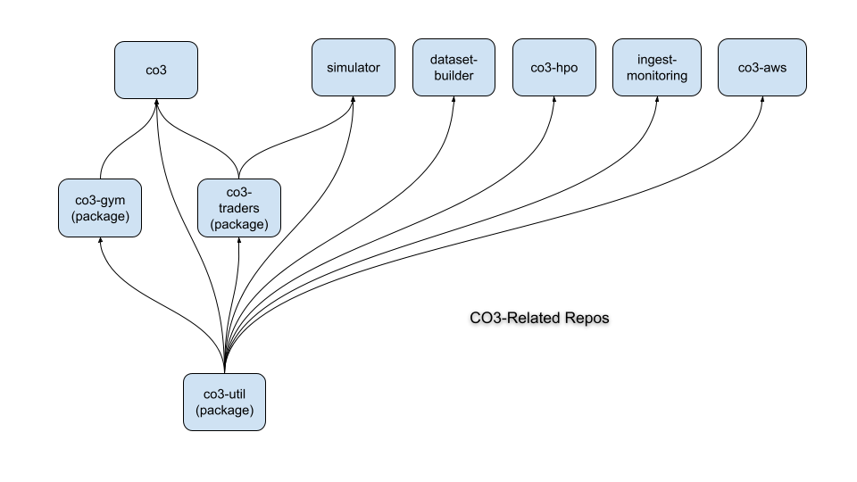

# Deep Reinforcement Learning Trading Framework (co3)

## Introduction
The content of this repository is an extract of a Deep Reinforcement Learning (DRL) framework used for High Frequency Trading (HFT) on cryptocurrency markets.

        `co3` is the project mneumonic that is used throughout.

The project consists of a number of repositories, as represented by the following graphic.  Of the many repositories indicated, only 'co3' - this one - is available publicly.  

The other key repository is referred to as `co3-gym` in the diagram.  `co3-gym` implements a number of environments all dervied from the OpenAI gym framework (https://www.gymlibrary.ml/)

## Theory of Operation ##
`co3` starts by capturing its configuration from the selected configuration YAML file using OmegaConf (https://github.com/omry/omegaconf)  and then immediately transforming the configuration into a configuration object using pydantic (https://pydantic-docs.helpmanual.io/).

Then based on the configuration, the following is performed:
1. The selected `gym` environment is activated.
2. The agent is initiated.  Configuration possibilities allow for both selecting which agent type (most of the standard DRL agent's are available) and then, within that selection, the specific neural network (allowing for fully connected networks or with one or more convolutional prefix networks).
3. Then the agent drops into the classic DRL loop that carries out the configured number episodes.
4. As expected, the agent communicates with the selected environment via the usual gym interface (the prime ones being `reset()` and `step()`).

The project is supported with a number of pytests that can be found in the ./co3/tests folder.

### Python Version

The specific Python version may advance throughout the life of the project and will be noted here. Currently the recommended version is `3.10.4`. Only the first 2 numbers are needed to refer to the Python run-time; in order to avoid duplication, a generic Python version will be referred to below as pythonX.Y.

It has been found that the safest and most reliable means to install/upgrade Python is from source. The reader is invited to google "ubuntu install pythonX.Y" for the specifics as to how to install from source.

## Outputs

1.  `logs`: For each run, a new log file is created in the folder CO3_PATH/logs. The names of log files have the form 'YYYY-MM-DDTHH:MM:SS.log'. Log file content mirrors the console log messages.

2.  `rewards`: For each run, a new CSV file is created containing a history of the rewards that were allocated to each episode and step within each episode. Each line of the file contains the episode number, the step number, and the reward. Note that the name of the file is of the form 'YYYY-MM-DDTHH:MM:SS.csv'. All such files are recorded into the folder \$CO3_PATH/rewards.

3.  `networks`: During execution and at the end of each episode the policy is retrained and a snapshot of the new policy is recorded to the file: `$CO3_PATH/policy/policy.pt` Note: each snapshot overwrites the previous.

4.  `datasets`: Because the determination of state is an expensive operation, it is possible to save each state to the database and then replay a run without the need to recalculate each state. Refer to the following command line parameters: `db-action` and `state-name`.

## Cleaning

Remove unused imports and variables

        $ autoflake -i -r --remove-all-unused-imports --remove-unused-variables co3

